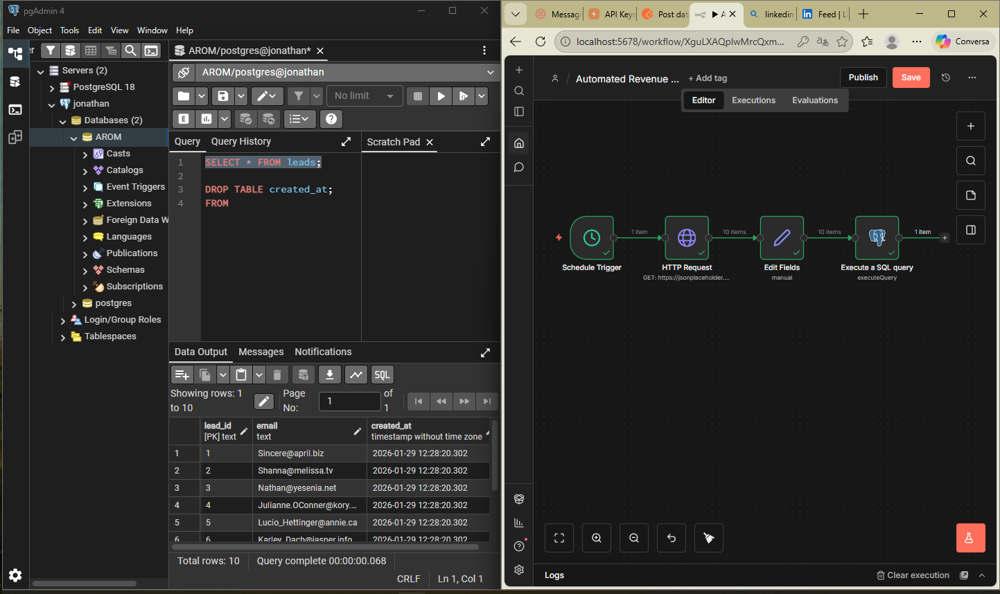

## 📸 Workflow Screenshot



# 🚀 Lead Ingestion Automation (n8n + PostgreSQL)

This project is the first workflow of a larger system called **Automated Revenue & Operations Monitor**.

The goal is to automate lead capture and persistence, creating a reliable foundation for metrics, alerts, and operational intelligence.

---

## ✅ Workflow 1 — Lead Ingestion Pipeline

This workflow automatically:

- Runs on a scheduled trigger (Cron)
- Fetches leads from an external API (CRM, forms, etc.)
- Normalizes incoming data into a clean schema
- Stores leads into PostgreSQL using UPSERT logic
- Prevents duplication and ensures consistent history

---

## 🧠 Architecture

Cron Trigger
↓
HTTP Request (API Leads)
↓
Data Normalization (Set Node)
↓
PostgreSQL Upsert (Insert or Update)


---

## ⚙️ Tech Stack

- **n8n** — Workflow orchestration
- **PostgreSQL** — Data persistence layer
- **REST APIs** — External lead sources

---

## 🗄️ Database Schema

```sql
CREATE TABLE leads (
  lead_id TEXT PRIMARY KEY,
  email TEXT,
  status TEXT,
  source TEXT,
  created_at TIMESTAMP
);
```
---

## 🔥 Key Feature: UPSERT Protection

Leads are inserted safely with conflict handling:

ON CONFLICT (lead_id)
DO UPDATE SET ...


This makes the workflow production-ready for real business environments.

---

## 🚀 Next Steps

Workflow 2 will introduce:

Python-based metrics engine

Anomaly detection (conversion drops, stale leads)

Automated alerting via Slack/Email/WhatsApp

---

## 📌 Author

Jonathan — Automation Analyst in training
Focused on n8n + Python + SQL for Business Process Automation

